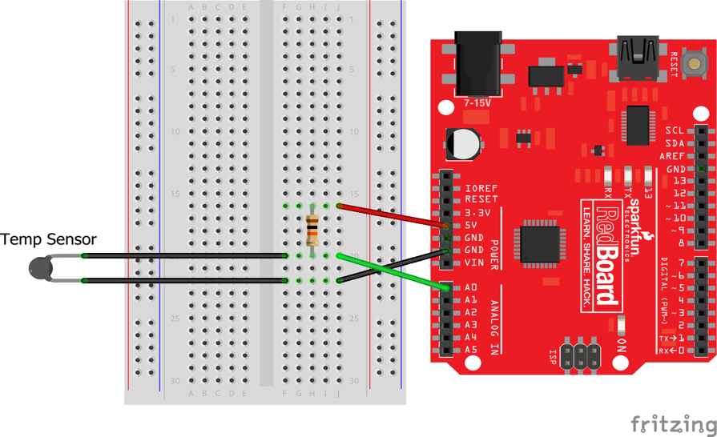
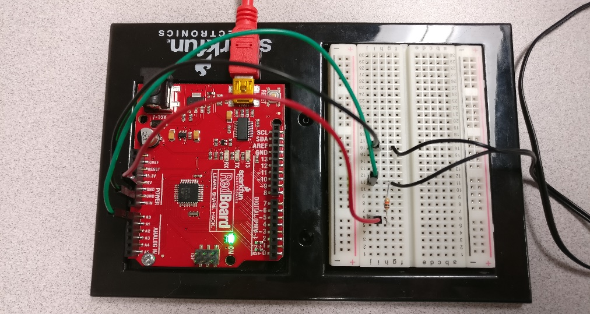
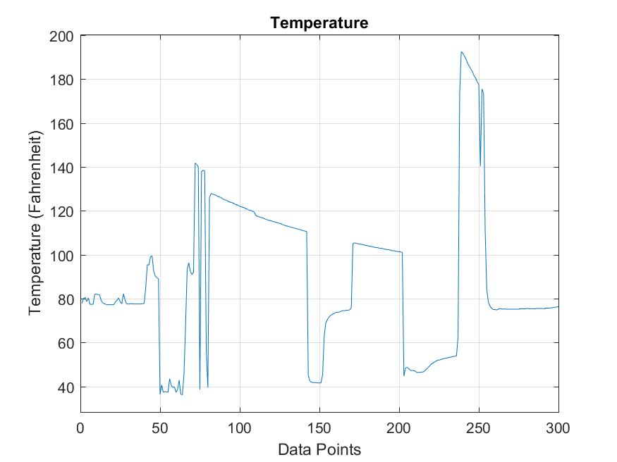

**Group Member Names:** Andy Graham, Marshall Reed, Jonathan Christian,
Mussie Bariagabir **Course and Quarter:** ENGR 114 Summer 2017

**Date:** 9/5/2017

**Final project:** Temperature Sensor

The Temperature Sensor
----------------------

#### 

#### **Problem Statement:**

In order for the fish tank and hydroponic garden (located in AM103) to
be sustained, there are many working parts that must be maintained,
including the utilization of a temperature sensor. The temperature
sensor takes readings from the water of the fish tank, in order to
provide information to a lab technician as to whether the water is too
warm (a situation where either the water pump would need to be turned on
to get the water flowing and/or the grow light be turned off to allow
the water to cool down), or too cool (which any running pump would need
to be turned off, and/or the grow light turned on).

Our group has been tasked with analyzing and developing code in Arduino
and MATLAB, which interprets sensor data taken in voltage from a
thermistor, converts it to temperature, then uploads that data to an IoT
(Internet of Things) server. We must also be able to retrieve the
information for future utilization by other groups.

To accomplish the task, our group has analyzed the Arduino code from a
previous term, and made several adjustments to ensure that the code
functioned as it should. It was then tested and calibrated to ensure
that it sent correct data to the serial port. We then downloaded
previously written MATLAB code and modified it to allow for the
uploading of the data to the IoT (in this case, ThingSpeak.org). MATLAB
code was also written for the retrieval of the data, in a form that is
easy to interpret, and provides a plot of the data.

**Hardware Process Flowchart** (taken from the
ENGR114\_Arduino\_IoT\_Project\_Description file)

**Hardware Setup:**

Bill of Materials:

| Part Name        | Purpose                                                                        | Item Name                                                                         | URL                                     | Price   |
|------------------|--------------------------------------------------------------------------------|-----------------------------------------------------------------------------------|-----------------------------------------|---------|
| Red Board        | Red board Arduino, uses to build electronic projects, in our case temp-sensor. | Arduino Circuit Board                                                             | https://www.sparkfun.com/products/13975 | $ 19.95 |
| Thermistor       | Temperature sensor                                                             | [10K Precision Epoxy Thermistor - 3950 NTC](https://www.adafruit.com/product/372) | https://www.adafruit.com/product/372    | $1.61   |
| 10k resistor     | Resisting flow of current that comes from red board to temp-sensor.            | 10k Resistor (red, black, orange, gold)                                           | https://www.sparkfun.com/products/11507 | $0.15   |
| breadboard       | To build the temp-sensor circuit schematic.                                    | Breadboard self-Adhesive (white)                                                  | https://www.sparkfun.com/products/12002 | $4.50   |
| Jumper wires     | connects breadboard to Arduino and to other piece of circuit.                  | Jumper wires-black, red, green, blue and white                                    | https://www.sparkfun.com/products/11026 | $1.95   |
| Mini B USB cable | Transferring data from Arduino to CPU                                          | USB Mini -B Cable-Red                                                             | https://www.sparkfun.com/products/11301 | $11.99  |

**Hardware Schematic** (obtained from previous year’s project on
Github.com)

**Hookup Guide (photograph taken by group)**
**:**

| ***Part***         | ***Pin***           | ***Connector***                                         | ***Pin***           | ***Part***          |
|--------------------|---------------------|---------------------------------------------------------|---------------------|---------------------|
| 10k Resistor       | Pin 6 (Breadboard)  | Red wire (from any side because resistor is non- polar) | 5v (voltage source) | Arduino (red board) |
| 10k Resistor       | Pin 11 (Breadboard) | Green wire                                              | A0                  | Arduino (red board  |
| Temp Sensor        | Pin 16 (Breadboard) | Black wire                                              | GRD (ground)        | Arduino (red board  |
| Temp Sensor        | Pin 11 (Breadboard) | Green wire                                              | A0                  | Arduino (red board  |
| Arduino (RedBoard) | USB port            | USB Cable (red)                                         | USB port            | CPU                 |

**MATLAB Code:**

Refer to file temp_sensor_send_retrieve.m

**Arduino Code:**

Refer to file tempsensor.ino

#### **Results:**

The results of multiple tests on the system are that the code
successfully took readings, then sent them to the IoT, which was
successfully retrieved by a separate computer. We were able to do
multiple runs of sent data and retrieve that data at any time afterward.
The data was collected at approximately 20 second intervals, and
captured in degrees Fahrenheit.

We were able to make user prompts simple, and simplify and organize a
lot of the code which was given to us. There are certain spots in the
code that, if not entered correctly, do error and result in a breakdown
(such as the entering of the serial port number, as that port number
changes on any computer, and if not entered correctly, there is no
comparison to what it should be).

The data retrieval does plot a graph based of the number of data points
or amount of time specified by the user prompt, and the data taken. It
is always displayed as temperature vs time. The example of 300 points of
data collection in plot follows:

Issues:

-   Depending on status of the network in use, the state of the
    computer, and several other factors, data sometimes ended up not
    transmitting completely and the sending program needed to be re-run.

-   The calibration of the thermistor was accurate to about +/- 2.0
    degrees of the actual read temperature (taken via hand-held
    digital thermometer) at any given time. The delay in the sent data
    compared to the reading of the temperature could be a factor, but it
    is more likely due to the precision of calibration in which
    we completed. Two degrees is an acceptable variance, and can be
    recalibrated with the utilization of a more accurate thermistor or
    temperature sensor.

We were able to make user prompts simple, and simplify and organize a
lot of the code which was given to us. There are certain spots in the
code that, if not entered correctly, do error and result in a breakdown
(such as the entering of the serial port number, as that port number
changes on any computer, and if not entered correctly, there is no
comparison to what it should be).

The data retrieval does plot a graph based of the number of data points
or amount of time specified by the user prompt, and the data taken. It
is always displayed as temperature vs time. The example of 100 points of
data collection in plot follows:

#### **Future Work:**

A number of future modifications could be made to this project to better
utilize data, and make it more user friendly, such as:

-   Creating the ability to remotely upload data (being able to pull the
    temperatures using an Arduino and internet connection to transmit
    the data points when requested)

-   Temperature data gathering at regular intervals to gather trends of
    temperatures in the tank throughout the day, in order to establish
    routines of turning pumps on/off, lights on/off, or a heater on/off
    at regular times.

-   The integration of the data gathered from the temperature sensor
    with the data from other sensors to better establish trends of the
    ecosystem of the tank, and make adjustments.

-   Monitoring the change in temperature of the water when it is pumped
    into the plant boxes and after it has traveled back to the tank
    could give clues and a segment of data to lead to whether
    adjustments should be made for the method to be more effective.

-   Programming which automatically sends alerts or feedback based on
    certain conditions (e.g. trends, alerts, etc.)

-   Developing code to prompt for data retrieval for certain times of
    day, certain days; specified data from time periods which has been
    stored on the IoT server.

-   Utilization of a proper temperature sensor as opposed to a
    thermistor would yield more accurate results, more
    accurate calibration.

-   **License**

MIT License

Copyright (c) 2017 Temperature Sensor Group (Marshall Reed, Jonathan
Christian, Mussie Bariagabir, Andy Graham)
